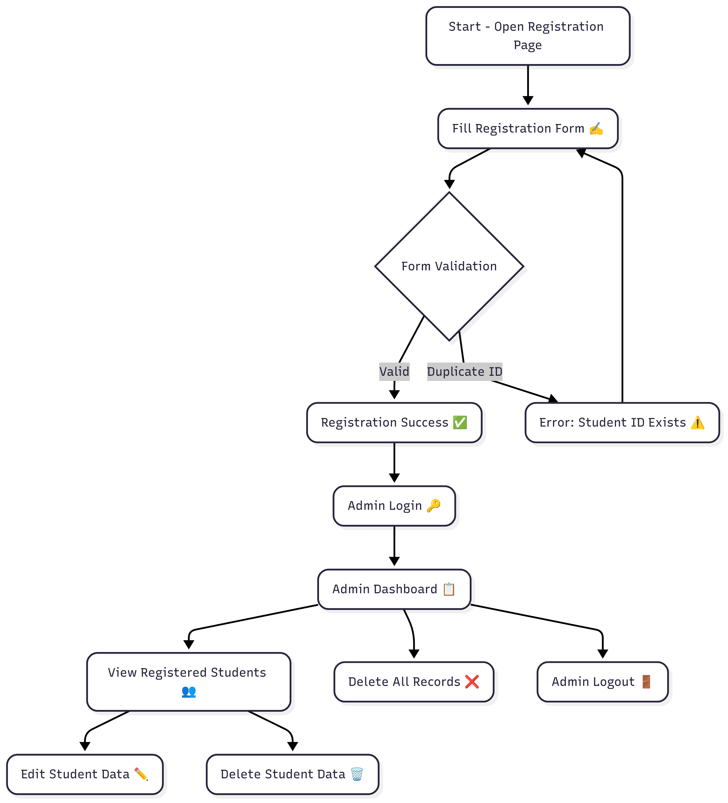
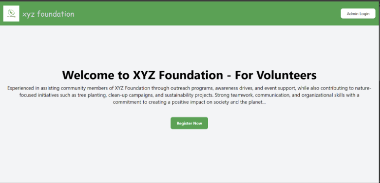
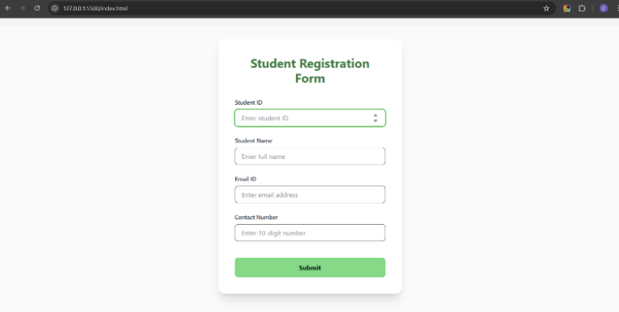
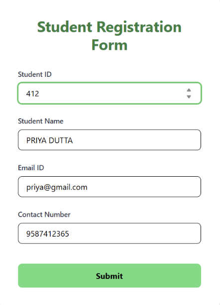
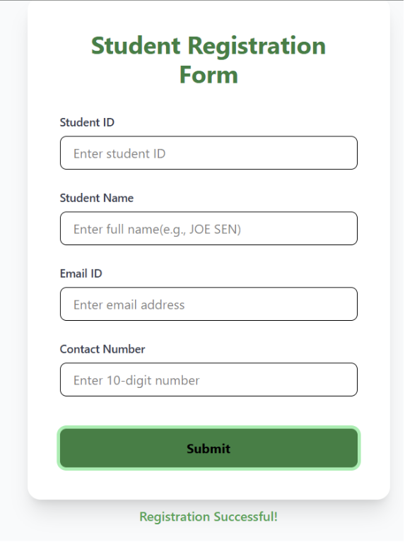
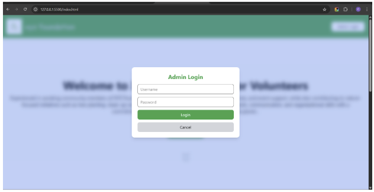
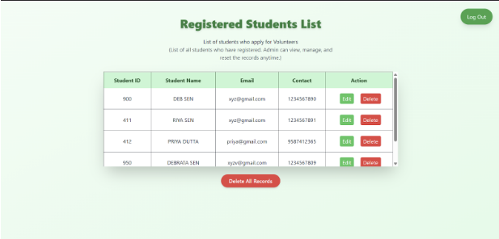
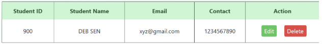
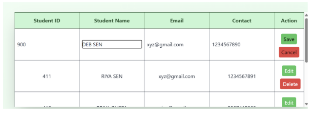
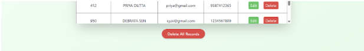

**Assignment:**

 **Student Registration System** 

         **Submitted By :**         

*Chaitali Mahato*

PROJECT OVERVIEW :

Lets say “XYZ Foundation” is a NGO who is taking students for the Volunteering Programme. 

This System comprises of the following functionalities: - 

*   College Students can REGISTER themselves through the submission form
    
*   Students have to enter their “student id” , “name” , “email” & “phone number”.
    
*   The System is capable of handling form field validations.
    
*   Student id is unique. i.e. more than one student cannot have same student id 
    
*   Admin login link is placed at the top right corner.
    
*   Admin has to enter username/password 
    
*   Admin can see all the registered students.
    
*   Admin can edit/delete records from the table for each Student
    
*   Admin can delete all the records at a single click
    
*   Admin can “Logout” by clicking the “logout” button from top right corner
    

         Github : [https://github.com/chaitali9497/student-registration-system](https://github.com/chaitali9497/student-registration-system)

         Admin login : username : **admin** , password : **Qwerty@123**              

PROJECT STRUCTURE :

Root

│

├── node\_modules/          # Installed npm packages (dependencies)

│

├── src/                   # Source folder (code + assets)

│   ├── images/            # Store images (logo, gif image.)

│   ├── index.js           # Main JavaScript file

│   ├── input.css          # Tailwind input file (before build)

│   └── output.css         # Compiled CSS file (after Tailwind build)

│

├── datacollect.html       # Page showing collected student data

├── index.html             # Homepage (registration)

│

├── package.json           # Project config (scripts, dependencies)

├── package-lock.json      # Exact dependency versions

PROJECT FLOW :

*   This is the Landing Screen. It has **“Register Now”** link, on clicking it will scroll to the bottom and focus on the submission form. 
    
*   Right Side corner has link to **“Admin Login”**

    

*   Below is the “Student Registration Form” with form fields “student id”, “name”, “email” and “contact number”

    

*   Student enter the details in the form

    

*   Upon successful registration a message **“Registration Successful!”** can be seen at the bottom of the form and form data gets reset.

    

*   If a student tries to register with the already existing “student id” , then a message will show up **“Student ID already exists. Please use a different one.”**

    
*   This is the “Admin Login” 

Admin Login modal popup will show up after click the Button.  Enter the below credentials.

User Name= **“admin”**

Password = **“Qwerty@123”**

*   This is the Dashboard view for Admin to Engage with the table. Here Admin can see all the registered students. 
    
*   Admin can Edit/Delete records of individual students. **All the data can be edited except** **Student ID**
    
*   Admin can also delete the complete data at once by clicking **“Delete All Records**” Button

In the edit button we can edit Name , Email and Contact Number.

**

EDIT

**

**

“Delete All Records”

**

**

“Log Out” button sign out the Admin and lands to Homepage.

**

\*\*\*\*\*\*\*\*\*\*\*\*\*\*\*\*\*\*\*\*\*\*\*\*\*\*\*\*\*\*\*\*\*\*\*\*\*     THANK YOU     \*\*\*\*\*\*\*\*\*\*\*\*\*\*\*\*\*\*\*\*\*\*\*\*\*\*\*\*\*\*\*\*\*\*\*\*\*\*\*\*\*\*